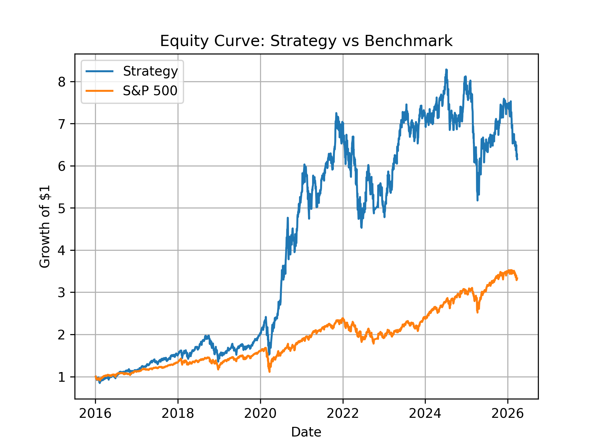

# DecisionAlpha — AI Portfolio Optimization & Backtesting Engine

## Overview

DecisionAlpha is a quantitative investment framework designed to simulate real-world portfolio decision-making using optimization and backtesting.

It combines financial modeling, operations research, and data-driven decision systems to evaluate strategies under uncertainty.

---

## Problem

Investors struggle to balance risk and return in dynamic and uncertain environments.

Traditional allocation methods fail to adapt to changing conditions, leading to inefficient decisions.

---

## Solution

This project implements a **decision system** that:

- Uses rolling-window optimization (no lookahead bias)
- Dynamically reallocates capital
- Applies realistic constraints (position limits, transaction costs)
- Benchmarks against market performance

---

## Methodology

1. Data ingestion via Yahoo Finance  
2. Data cleaning and validation  
3. Rolling window portfolio optimization (Modern Portfolio Theory)  
4. Backtesting with transaction costs  
5. Performance evaluation vs benchmark  

---

## Results

The strategy achieved:

- **~515% total return vs ~233% (S&P 500)**
- **Sharpe ratio: 0.76 vs 0.75**
- **Max drawdown: -37% vs -33%**

👉 The model outperforms in return while maintaining similar risk-adjusted performance, with higher downside volatility.

---

## Equity Curve

---

## Key Insights

- The model captures return opportunities through dynamic allocation  
- Performance is strong but sensitive to volatility  
- Drawdown control is the main improvement opportunity  

---

## Why This Matters

This is not just a financial model — it is a **decision system**.

It demonstrates how optimization, constraints, and data can be combined to support real-world decision making under uncertainty.

---

## Perspective

With a background in **Mathematics and Geopolitics**, this project reflects a broader approach to decision-making:

- dealing with uncertainty  
- modeling complex systems  
- understanding dynamic environments  

---

## Next Steps

- Volatility targeting  
- Drawdown control  
- Integration of macro/geopolitical signals  

---

## Tech Stack

- Python  
- Pandas / NumPy  
- PyPortfolioOpt  
- Matplotlib  
- Yahoo Finance  

---

## Author

Geovane — Decision Analyst focused on Optimization, AI, and Decision Systems